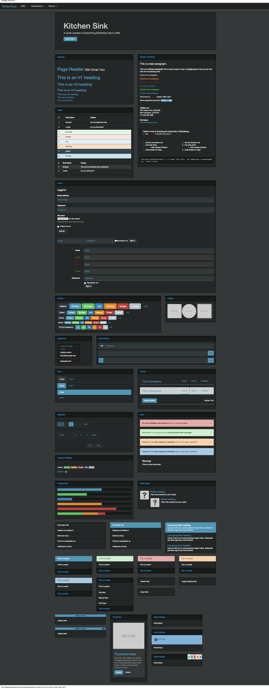
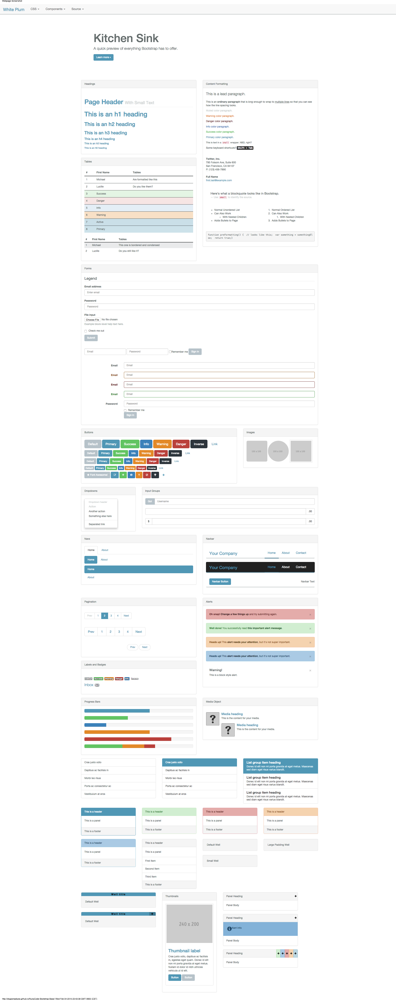

Themes
=======

Repos
-------
- `Base Theme <https://github.com/stygiansabyss/NukaCode-Bootstrap-Base>`_
- `Dark Theme <https://github.com/stygiansabyss/NukaCode-Bootstrap-Admin>`_

Installation
-------
.. hint:: You only need to have one of these.
::

    bower install -S nukacode-bootstrap-base#~0
    bower install -S nukacode-bootstrap-dark#~0

Examples
-------
You can find an example of each theme at their respective github.io page.

Dark
~~~~~~~

Base
~~~~~~~
